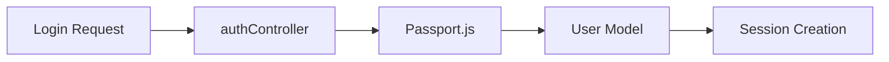
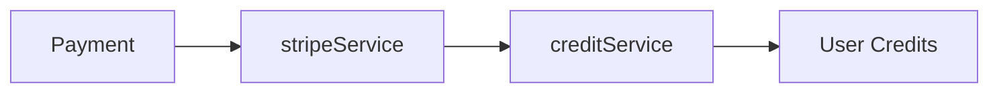
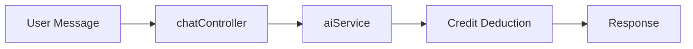

# AI Chat Platform with Multi-Model Support & Subscription System

## Table of Contents
- [Overview](#overview)
- [Features](#features)
- [Technology Stack](#technology-stack)
- [Project Structure](#project-structure)
- [Installation](#installation)
- [Configuration](#configuration)
- [API Documentation](#api-documentation)
- [Development](#development)
- [Testing](#testing)
- [Deployment](#deployment)

## Overview
Advanced AI chat platform integrating multiple language models with subscription-based access and automated credit management.

### Key Features
- 🤖 Multi-model AI support (GPT-4, Claude, Gemini)
- 💳 Subscription-based access control
- 📊 Automated 70/30 revenue distribution
- 🔄 Real-time credit monitoring
- 🔒 Secure payment processing

## Technology Stack
- **Backend**: Node.js, Express
- **Database**: MongoDB with Mongoose
- **Frontend**: EJS, JavaScript
- **Payment**: Stripe
- **Real-time**: Socket.IO
- **Authentication**: Passport.js

## File Structure & Functionality

### Controllers
```
controllers/
├── authController.js          # Handles user authentication
│   ├── register()            # New user registration
│   ├── login()              # User login with email/password
│   └── logout()             # Session termination
│
├── chatController.js         # Manages chat operations
│   ├── sendMessage()        # Processes user messages
│   ├── getHistory()         # Retrieves chat history
│   └── switchModel()        # Changes AI model
│
└── subscriptionController.js # Manages subscriptions
    ├── createSubscription() # Initiates new subscriptions
    ├── cancelSubscription() # Handles cancellations
    └── getStatus()         # Checks subscription status
```

### Middlewares
```
middlewares/
├── accessControl.js          # Security & rate limiting
│   ├── rateLimit()          # Request throttling
│   ├── authenticate()       # Session verification
│   └── authorize()          # Permission checking
│
└── subscriptionMiddleware.js # Subscription validation
    ├── checkCredits()       # Verifies available credits
    └── validateAccess()     # Checks model access rights
```

### Models
```
models/
├── apiCredit.js             # Credit transaction schema
│   ├── balance              # Available credits
│   ├── transactions         # Credit usage history
│   └── distributions        # 70/30 split tracking
│
├── chat.js                  # Chat message schema
│   ├── messages            # Message content & metadata
│   ├── participants        # User information
│   └── modelDetails        # AI model configuration
│
├── subscription.js          # Subscription schema
│   ├── plan                # Subscription tier
│   ├── status              # Active/inactive state
│   └── billingDetails      # Payment information
│
└── user.js                 # User account schema
    ├── profile             # User information
    ├── authentication      # Login credentials
    └── preferences         # User settings
```

### Services
```
services/
├── aiService.js            # AI model integration
│   ├── modelSelector()     # Model switching logic
│   ├── processMessage()    # Message handling
│   └── streamResponse()    # Real-time responses
│
├── creditService.js        # Credit management
│   ├── distribute()        # 70/30 revenue split
│   ├── deduct()           # Usage tracking
│   └── monitor()          # Balance checking
│
├── stripeService.js        # Payment processing
│   ├── createCustomer()    # Customer management
│   ├── processPayment()    # Payment handling
│   └── handleWebhook()     # Stripe event processing
│
└── subscriptionService.js  # Subscription logic
    ├── create()           # New subscriptions
    ├── cancel()           # Cancellation handling
    └── update()           # Plan changes
```

### Views
```
views/
├── partials/              # Reusable components
│   ├── header.ejs        # Navigation bar
│   └── footer.ejs        # Page footer
│
├── chatscreen.ejs        # Main chat interface
│   ├── messageList       # Chat history display
│   ├── inputArea        # Message input
│   └── modelSelector    # AI model selection
│
├── subscription.ejs      # Subscription management
│   ├── planList         # Available plans
│   ├── paymentForm      # Stripe integration
│   └── statusDisplay    # Current plan info
│
└── auth/                # Authentication pages
    ├── login.ejs       # Login form
    └── register.ejs    # Registration form
```

### Configuration Files
```
root/
├── .env                 # Environment variables
├── package.json         # Project dependencies
├── server.js           # Application entry point
└── app.js              # Express configuration
```

### Key Workflows

1. **User Authentication Flow**


2. **Subscription Process**


3. **Chat Operation**


## Installation

```bash
# Clone repository
git clone https://github.com/yourusername/ai-chat-platform.git

# Install dependencies
cd ai-chat-platform
npm install

# Set up environment variables
copy .env.example .env

# Start development server
npm run dev
```

## Configuration

### Environment Variables
```env
# Server Configuration
PORT=3000
NODE_ENV=development

# Database
MONGODB_URI=mongodb://localhost:27017/ai-platform

# Stripe Keys
STRIPE_SECRET_KEY=sk_test_...
STRIPE_PUBLISHABLE_KEY=pk_test_...
STRIPE_WEBHOOK_SECRET=whsec_...

# AI Model Keys
OPENAI_API_KEY=sk-...
ANTHROPIC_API_KEY=sk-...
GOOGLE_API_KEY=...
```

### Subscription Plans
```javascript
const PLANS = {
  basic: {
    price: 9.99,
    credits: 100,
    models: ['gpt-4']
  },
  pro: {
    price: 29.99,
    credits: 500,
    models: ['gpt-4', 'claude-sonnet', 'deepseek']
  }
};
```

## API Documentation

### Authentication Endpoints
```http
POST /auth/register
Content-Type: application/json

{
  "email": "user@example.com",
  "password": "securepassword"
}

POST /auth/login
GET /auth/logout
```

### Subscription Endpoints
```http
GET /subscription/plans
POST /subscription/create
POST /subscription/cancel
GET /subscription/status
```

### Chat Endpoints
```http
POST /chat/message
GET /chat/history
POST /chat/model
```

## Development

### Running Development Server
```bash
npm run dev
```

### Code Style
- ESLint configuration
- Prettier formatting
- TypeScript definitions

### Database Migrations
```bash
npm run migrate:up
npm run migrate:down
```

## Testing

### Unit Tests
```bash
npm run test:unit
```

### Integration Tests
```bash
npm run test:integration
```

### E2E Tests
```bash
npm run test:e2e
```

## Deployment

### Production Build
```bash
npm run build
```

### Production Start
```bash
npm start
```

### Docker Deployment
```bash
docker build -t ai-chat-platform .
docker run -p 3000:3000 ai-chat-platform
```

## Monitoring

### Credit System
- Automated hourly credit checks
- Low balance notifications
- Usage analytics dashboard

### Error Handling
- Centralized error logging
- Webhook monitoring
- Transaction validation

## Security Measures
- Rate limiting
- Input validation
- XSS protection
- CSRF tokens
- API key encryption

## Contributing
Please read [CONTRIBUTING.md](CONTRIBUTING.md) for details on our code of conduct and the process for submitting pull requests.

## License
This project is licensed under the MIT License - see the [LICENSE.md](LICENSE.md) file for details.

## Support
- Documentation: `/docs`
- API Reference: `/api-docs`
- Email: support@platform.com